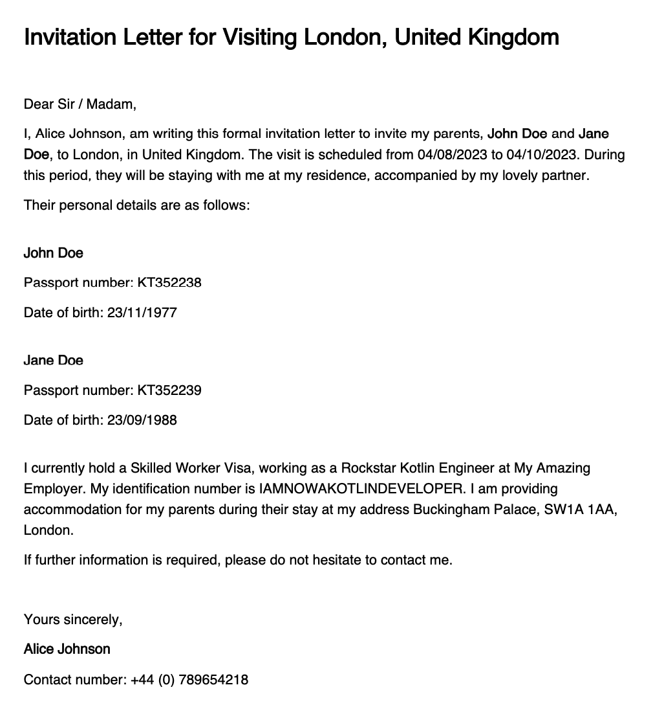

# UK Invitation Letter Generator

This Kotlin application simplifies the process of creating invitation letters for UK visitors. It utilizes a JSON configuration file to compile necessary details about the host, guests, and visit specifics, producing a formal invitation letter in PDF format.

## Why This Project Exists

Creating personalized invitation letters for visiting friends and family can be time-consuming. This project was born from a personal need to streamline the process, combining a practical solution with an opportunity to refine my Kotlin skills.

## Key Features

- Parses host, guest, and visitation details from a specified JSON file.
- Crafts a personalized invitation letter from the parsed details.
- Outputs the letter as a PDF file, ready for printing or emailing.
- See the [example section below](#example-of-generated-pdf-image) for a visual preview.

## Getting Started

### Prerequisites

- Java Development Kit (JDK) version 8 or newer.
- Gradle for building and running the application.
- Make (optional) simplifies the execution process through predefined commands.

### Setup and Execution

#### Configuring Your Invitation

Start by modifying `config.sample.json` to include your specific invitation details.

#### Building the Project

To compile the project, run:

```bash
./gradlew build
```

#### Generating Your Letter

**Using Make (Recommended):**

```bash
make letter CONFIG_PATH=/path/to/your-config.json OUTPUT_PATH=/path/to/output/invitation-letter.pdf
```

**Using Gradle:**

To execute the application with Gradle, use:

```bash
./gradlew run --args="-c './config.sample.json' -o '.'"
```

- `configPath`: Path to your JSON configuration file.
- `outputPath`: Destination for the generated PDF.

Alternatively, update the `gradle.properties` with your configuration and outputPath, then run:

```bash
./gradlew run
```

#### Running Tests

Execute the test suite with:

```bash
./gradlew test
```

## Example of Generated PDF (image)

Here's a preview of what the generated PDF looks like:



## Acknowledgments

* Renato Araujo - [LinkedIn Profile](https://www.linkedin.com/in/renatoraraujo/)

## License

This project is released under the MIT License - see the [LICENSE](LICENSE) file for details.